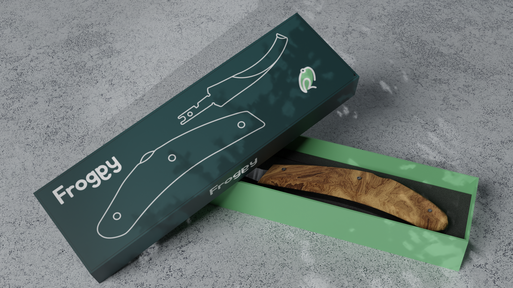

<!-- PROJECT SHIELDS -->
[![Netlify Status][netlify-shield]][netlify-url]
[![Issues][issues-shield]][issues-url]
[![Stars][stars-shield]][stars-url]
[![Coffee][coffee-shield]][coffee-url]
[![LinkedIn][linkedin-shield]][linkedin-url]

<!-- PROJECT LOGO -->
 

  

<h3 align="center">ACR - Froggy Three.js Website</h3>

  

    As part of my job, I have to create a showcase site to present a tool for farriers. I decided to challenge myself by modeling the tool in 3D on blender and integrating it to the website with three.js.  So you will see here the progress of the project 😁
     
     
  

<!-- TABLE OF CONTENTS -->

  
Table of Contents

  <ol>
    <li>
      <a href="#about-the-project">About The Project</a>
      <ul>
        <li><a href="#built-with">Built With</a></li>
        <li><a href="#designed-with">Designed With</a></li>
        <li><a href="#blender-material">Blender Material</a></li>
        <li><a href="#threejs-course">ThreeJS Course</a></li>
        <li><a href="#render-blender">Render Blender</a></li>
      </ul>
    </li>
    <li><a href="#roadmap">Roadmap</a></li>
    <li><a href="#license">License</a></li>
    <li><a href="#contact">Contact</a></li>
  </ol>

<!-- ABOUT THE PROJECT -->
## About The Project

[![Product Name Screen Shot][product-screenshot]][product-url]

<i>Last screenshot - 06/12/2022</i>
 
For this project, I had to learn three.js and blender. I started with small tests here and there. After having the basics in three.js I started to develop the website, you can find the roadmap below. The website must have several features. We must be able to go around the tool, without crossing the ground and limiting the zoom. We must be able to customize the handle of the tool, as well as define the type of blade and select the dominant hand (right-handed, left-handed). The website must be available in French, English and German. The order button must redirect to the store with the configuration selected by the user. Finally an optimization work should be done to lower the loading time and increase the performance.

(<a href="#readme-top">back to top</a>)

### Built With

* [![Htlm][html-shield]][html-url]
* [![Css3][css3-shield]][css3-url]
* [![JS][javascript-shield]][javascript-url]
* [![ThreeJS][threejs-shield]][threejs-url]

(<a href="#readme-top">back to top</a>)

### Designed With

* [![Blender][blender-shield]][blender-url]
* [![Figma][figma-shield]][figma-url]
* [![AI][ai-shield]][ai-url]

(<a href="#readme-top">back to top</a>)

### Blender Material

[![Blender Market Screen Shot][blendermarket-screenshot]][blendermarket-url]
For my 3D model, I used the "Realtime materials 2.0" material pack. You can find it [here](https://www.blendermarket.com/products/realtime-materials-for-blender)

### ThreeJS Course

[![Three.JS Journey][threejsjourney-screenshot]][threejsjourney-url]
I learned and I learn three.js with the courses of bruno simon, on three.js Journey. You can find it [here](https://threejs-journey.com/)

### Render Blender

  

  
  
  

<!-- ROADMAP -->
## Roadmap

- [x] Learn the basics of blender
    - [x] Modeling the tool precisely
        - [ ] Modeling the last tool version
            - [x] Curved and straight blade (sent by david)
            - [ ] Drawing of the new handle by david / modeling on blender
                - [ ] Improve textures and baked the file
    - [x] Create / Apply textures and shadings
    - [x] Create a scene with the tool and make a good quality rendering
    - [x] Exported the file in gltf
        - [x] Fix texture problem due to bad export parameter on blender
- [x] Learn three.js and develop the website
    - [x] Create the scene of three.js
    - [x] Import the 3D model
        - [x] Position the model in the center of the scene
        - [x] Fix texture problem due to bad export parameter on blender
    - [x] Create the floor
        - [x] Apply a dark wood plank texture
    - [x] Add camera
    - [x] Add the different lights
    - [x] Add Orbit Controls
        - [x] Limit the position
- [x] Develop the html css side
    - [x] Create the header with the logo and the menu
    - [x] Create the body
        - [x] Add input range related to mouse scroll and Orbit Controls zoom
        - [x] Add the buttons to order
            - [ ] Link the button according to the selected configuration and redirect to the store
        - [x] Add the selector for the handle tool (if possible linked to the stick position in the scene)
        - [ ] Add a selector for the choice of the type of blade (if possible linked to the position of the blade in the scene)
        - [ ] Add a selector for the dominant hand (right-handed, left-handed)
            - [x] ⚠️ WARN ⚠️ Find a solution to change only the texture and not to load a new model each time
- [x] Add a loading screen, linked to the loading of different 3D objects
- [ ] Adapt the website for all devices

See the [open issues](https://github.com/A-C-Concepts/Froggy/issues) for a full list of proposed features (and known issues).

(<a href="#readme-top">back to top</a>)

<!-- ROADMAP -->

<!-- LICENSE -->
## License

Distributed under the MIT License. See `LICENSE.txt` for more information.

(<a href="#readme-top">back to top</a>)

<!-- CONTACT -->
## Contact

ROSERAT Ugo - roserat.ugo@gmail.com

Project Link: [https://github.com/A-C-Concepts/Froggy](https://github.com/A-C-Concepts/Froggy)

(<a href="#readme-top">back to top</a>)

<!-- MARKDOWN LINKS & IMAGES -->
<!-- https://www.markdownguide.org/basic-syntax/#reference-style-links -->
[forks-shield]: https://img.shields.io/github/forks/A-C-Concepts/Froggy-Three?style=for-the-badge
[forks-url]: https://github.com/A-C-Concepts/Froggy-Three/network/members
[stars-shield]: https://img.shields.io/github/stars/A-C-Concepts/Froggy-Three?style=for-the-badge
[stars-url]: https://github.com/A-C-Concepts/Froggy-Three/stargazers
[issues-shield]: https://img.shields.io/github/issues/A-C-Concepts/Froggy-Three?style=for-the-badge
[issues-url]: https://github.com/A-C-Concepts/Froggy-Three/issues
[license-shield]: https://img.shields.io/github/license/A-C-Concepts/Froggy-Three?style=for-the-badge
[license-url]: https://github.com/A-C-Concepts/Froggy-Three/blob/master/LICENSE.txt
[linkedin-shield]: https://img.shields.io/badge/-LinkedIn-black.svg?style=for-the-badge&logo=linkedin&colorB=555
[linkedin-url]: https://www.linkedin.com/in/ugo-roserat/
[product-screenshot]: img/screenshot.png
[product-url]: https://acr-froggy.netlify.app/
[blendermarket-screenshot]: img/blendermaterial.png
[blendermarket-url]: https://www.blendermarket.com/products/realtime-materials-for-blender
[threejsjourney-screenshot]: img/threejsjourney.png
[threejsjourney-url]: https://threejs-journey.com/
[html-shield]: https://img.shields.io/badge/HTML5-E34F26?style=for-the-badge&logo=html5&logoColor=white
[html-url]: https://html.com/
[css3-shield]: https://img.shields.io/badge/CSS3-1572B6?style=for-the-badge&logo=css3&logoColor=white
[css3-url]: https://www.w3.org/Style/CSS/Overview.en.html
[javascript-shield]: https://img.shields.io/badge/JavaScript-F7DF1E?style=for-the-badge&logo=javascript&logoColor=black
[javascript-url]: https://www.javascript.com/
[coffee-shield]: https://img.shields.io/badge/Buy_Me_A_Coffee-FFDD00?style=for-the-badge&logo=buy-me-a-coffee&logoColor=black
[coffee-url]: https://www.buymeacoffee.com/RoseratUgo
[netlify-shield]: https://img.shields.io/netlify/b3e75b20-cb15-416e-93d8-6932fc619e36?style=for-the-badge
[netlify-url]: https://app.netlify.com/sites/acr-froggy/deploys
[threejs-shield]: https://img.shields.io/badge/threejs-black?style=for-the-badge&logo=three.js&logoColor=white
[threejs-url]: https://threejs.org/
[blender-shield]: https://img.shields.io/badge/blender-%23F5792A.svg?style=for-the-badge&logo=blender&logoColor=white
[blender-url]: https://www.blender.org/
[figma-shield]: https://img.shields.io/badge/figma-%23F24E1E.svg?style=for-the-badge&logo=figma&logoColor=white
[figma-url]: https://www.figma.com/
[ai-shield]: https://img.shields.io/badge/adobe%20illustrator-%23FF9A00.svg?style=for-the-badge&logo=adobe%20illustrator&logoColor=white
[ai-url]: https://www.adobe.com/fr/products/illustrator.html
